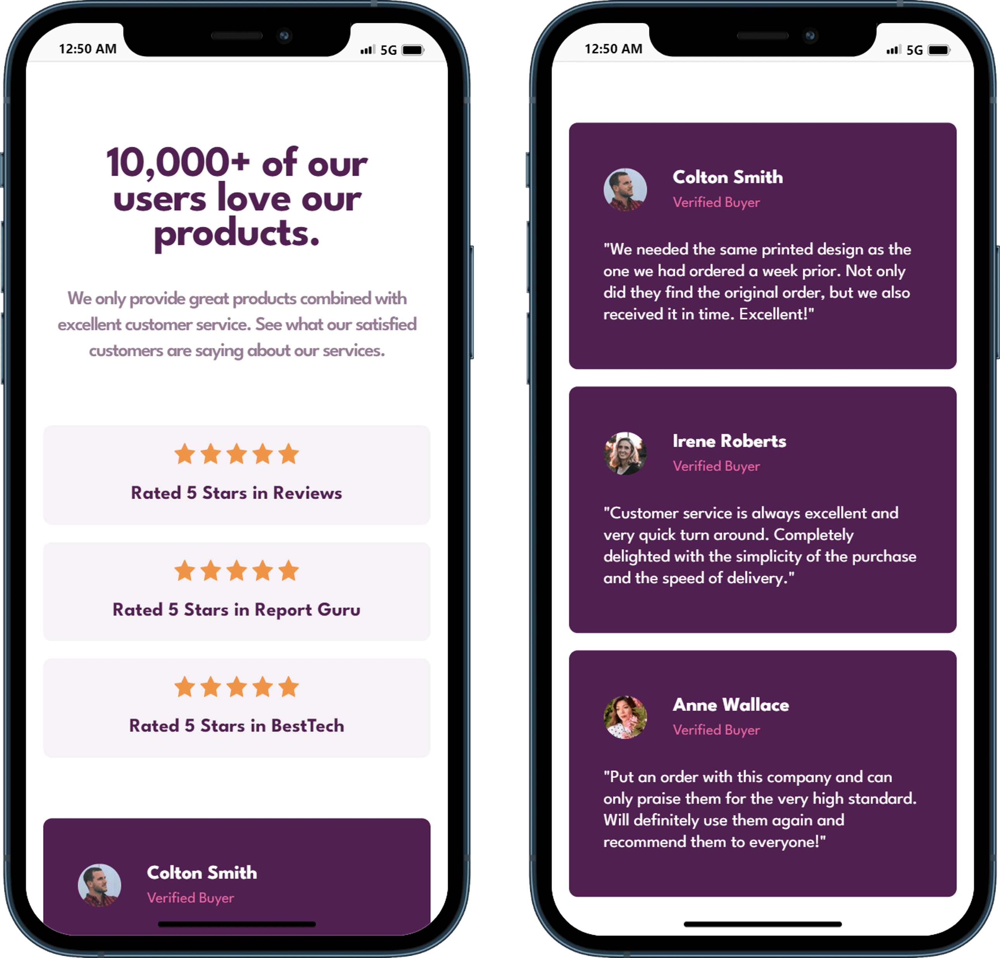
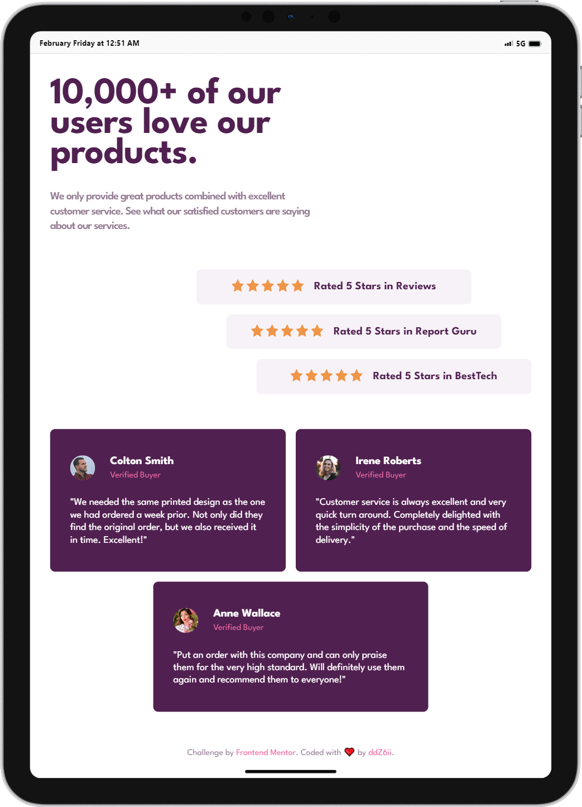
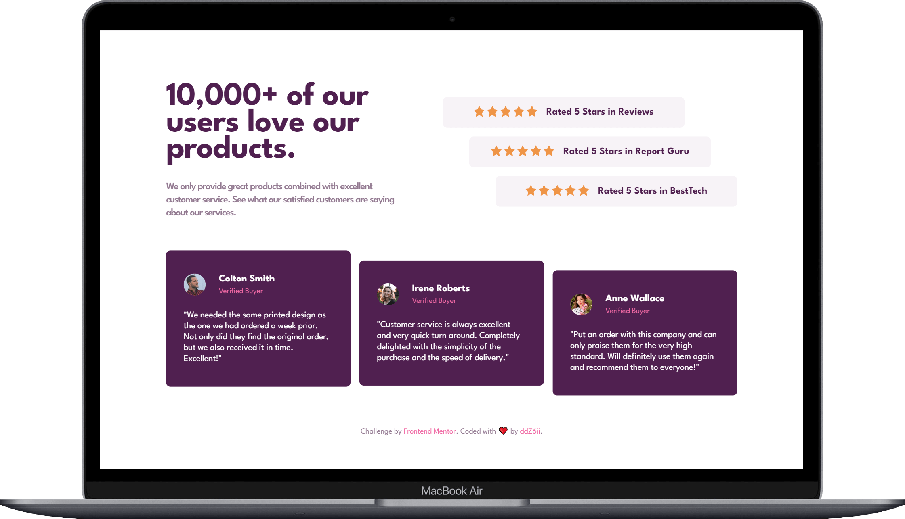

# Frontend Mentor - Social proof section solution

This is a solution to the [Social proof section challenge on Frontend Mentor](https://www.frontendmentor.io/challenges/social-proof-section-6e0qTv_bA). Frontend Mentor challenges help you improve your coding skills by building realistic projects.

## Table of contents

- [Overview](#overview)
  - [The challenge](#the-challenge)
  - [Screenshots](#screenshots)
  - [Links](#links)
- [Getting started](#getting-started)
- [My process](#my-process)
  - [Built with](#built-with)
  - [Deployed with](#deployed-with)
  - [What I learned](#what-i-learned)
  - [Useful resources](#useful-resources)
- [Author](#author)

## Overview

### The challenge

Users should be able to:

- View the optimal layout for the section depending on their device's screen size

### Screenshots

- Phone:
  

- Tablet:
  

- Laptop/Desktop:
  

### Links

- Solution URL: [frontend-mentor-solution](https://www.frontendmentor.io/solutions/responsive-page-using-css-grid-column-layout-and-flexbox-RRM6SZx9dV)
- Live Site URL: [social-proof-section](https://social-proof-section-lyart-five.vercel.app/)

## Getting started

Clone the project and run the following command:

```console
yarn install
```

This will initialize the project by installing all the required dependencies.

## My process

### Built with


- Semantic HTML5 markup
- Sass with BEM convention
- Flexbox
- CSS Grid (12/8/4 column grid layout)
- Parcel bundler
- Mobile-first workflow

### Deployed with


### What I learned

Dart Sass just rocks 🚀

```scss
/// Responsive grid layout
%responsive-grid {
  @each $_key, $_val in b.$breakpoints {
    @include m.screen-min($_key) {
      @include m.grid-layout($_key);
    }
  }
}

/// Breakpoint manager (from...)
/// @param {String} $_keymin - Breakpoint keyword for screen min-width
/// @requires $breakpoints - Breakpoint map
@mixin screen-min($_keymin) {
  @if map-has-key(b.$breakpoints, $_keymin) {
    $_min-width: map-get(b.$breakpoints, $_keymin);
    @media only screen and (min-width: $_min-width) {
      @content;
    }
  } @else {
    @error 'the keyword #{$_keymin} is not in the $breakpoints map';
  }
}

/// Responsive grid layout manager
/// @param {String} $_keymin - Breakpoint keyword for screen min-width
@mixin grid-layout($_keymin) {
  @if map-has-key(g.$grid, $_keymin) {
    $_map: map-get(g.$grid, $_keymin);
    $_margin: map-get($_map, 'margin');
    $_cols: map-get($_map, 'cols');
    $_gutter: map-get($_map, 'gutter');

    margin-inline: $_margin;
    grid-template-columns: repeat($_cols, 1fr);
    column-gap: $_gutter;
  } @else {
    @error 'the keyword #{$_keymin} is not in the $grid map';
  }
}
```

### Useful resources

- [Sass guidelines](https://sass-guidelin.es/) - This helped me architecting my project hierarchy thanks to Kitty Giraudel's 7-1 pattern.
- [Sass and BEM for beginners](https://www.youtube.com/watch?v=jfMHA8SqUL4) - Great tutorial to discover Sass from Coder Coder. I'd recommend it to anyone still learning this concept.
- [How to bundle a web app with parcel.js](https://www.digitalocean.com/community/tutorials/how-to-bundle-a-web-app-with-parcel-js) - Great tutorial by Kong Yang about how to use Parcel to build and bundle a small web application that contains HTML, CSS, and JavaScript files.

## Author

- Github - [@ddZ6ii](https://github.com/ddZ6ii)
- Frontend Mentor - [@ddZ6ii](https://www.frontendmentor.io/profile/ddZ6ii)
- Linkedin - [@denis-dezest](https://www.linkedin.com/in/denis-dezest/)
